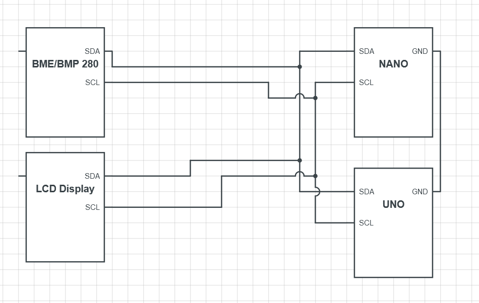
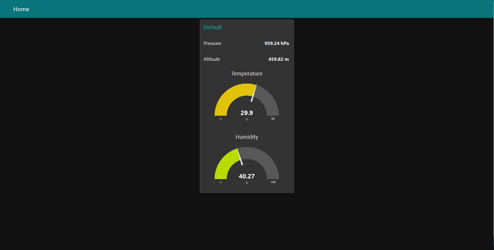

# VIN-Project: Weather station 2.0

A simple weather station implementation with 2 Arduino microcontrollers for my undergraduate Input-Output devices course.

## 1. How it works:

The project is implemented via a master-slave architecture, where the slave microcontroller (Arduino NANO) controls the BME/BMP 280 sensor and
sends data to the master device upon request. The master device (Arduino UNO R3) requests the data, one metric at a time, from the slave, waits 
until the buffers for all metrics (temperature, humidity, pressure, approx. altitude) are full, before displaying the data on an lcd display 
and shipping it off to a Node-RED dashboard.

## 2. Used components:

This project uses the following components:
- 1x Arduino UNO R3
- 1x Arduino NANO
- 1x Breadboard
- 1x LCD I2C display
- 1x BME/BMP280 sensor (I2C device)
- 14x jumper wires 

## 3. Used libraries:

This project uses the following libraries:
- Wire.h
- Adafruit_Sensor.h 
- Adafruit_BME280.h
- LiquidCrystal_I2C.h

The station.ino file (the slave implementation) uses the adafruit sensor libraries, and the
server.ino file (the master implementation) uses the liquid crystal library. Both use the Wire library.

## 3. Circuit diagram:

The main components should be wired together as following (ofcourse the implementation will vary, as the components differ.):
 

 

### 3.1 Explanation of the circuit:

As seen in the picture above, the Arduinos' SDA and SCL pins are wired directly to one another, which enables them to communicate via the i2c protocol. Other devices, such as 
the display and sensor, are connected in parallel. This is possible because each i2c device has it's own address, which allows the communication to run uninterrupted. As such, the
slave device can freely access the sensor and transmit data to the master device, without, for example, interfering with the display.

## 4. Web dashboard:

This project can also interface with a web dashboard implemented in Node-RED. The dashboard displays the temperature and humidity as gauges, and approximate altitude and pressure as numerical values.

The dashboard looks as such:
 

 

### 4.1 How to setup:

To setup the dashboard, simply install Node-RED on your computer, run it and open the site at localhost, where you will see your flows. From there, simply import the flow located in
[dashboard](dashboard/flows.json), and adjust the COM port on which it will receive the data.
